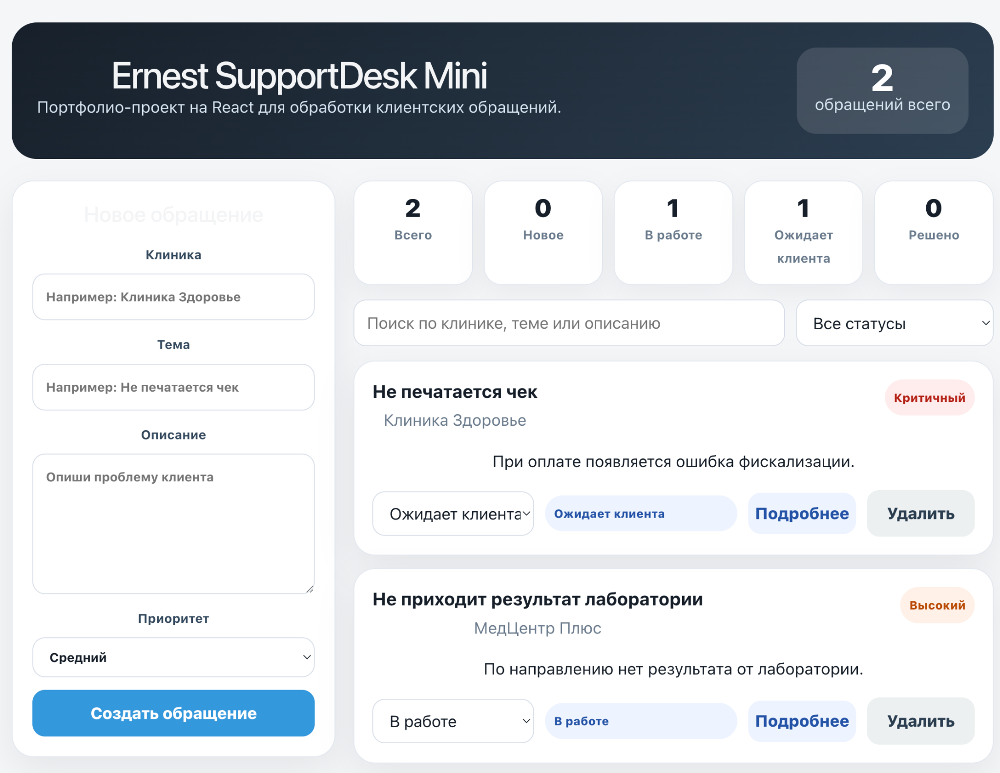
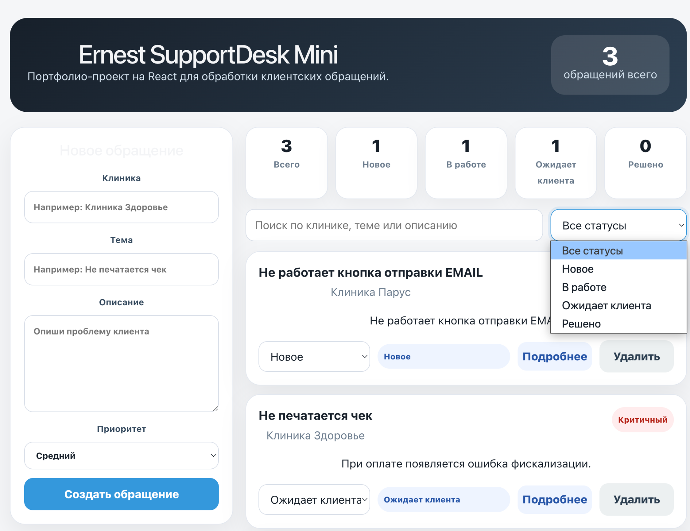
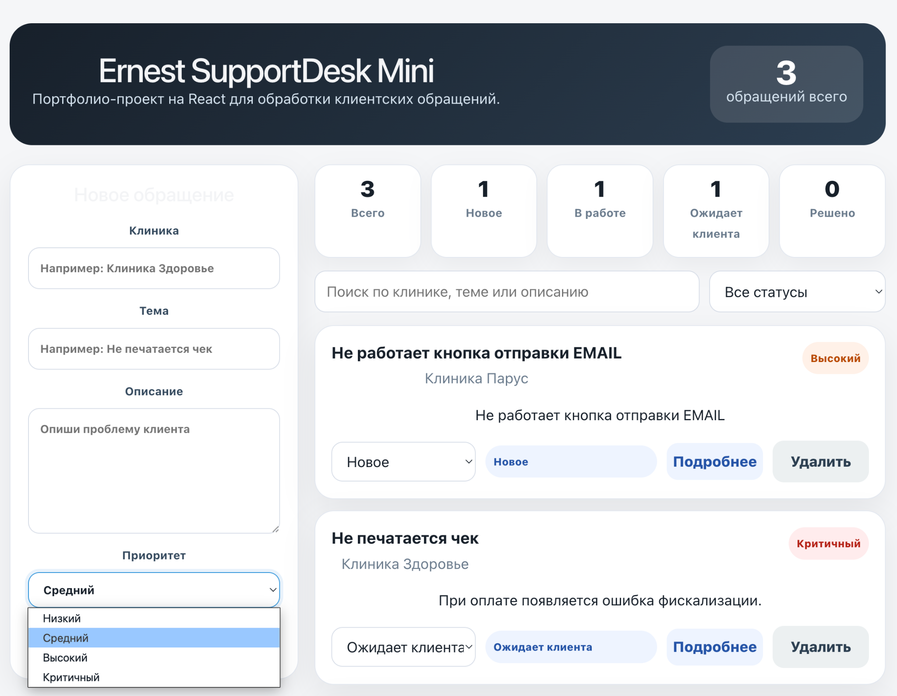

# Ernest SupportDesk Mini

React support desk app for managing client requests, ticket statuses and internal workflow.

## 🚀 Demo

[Open Live Demo](https://mrssstrange.github.io/ernest-supportdesk/)

## 📸 Screenshots

### Main Dashboard



### Status Filter



### Priority Select



## 🧰 Tech Stack

* React
* TypeScript
* Vite
* CSS

## ✨ Features

* Create client support requests
* Manage request statuses
* Filter requests by status
* Search by clinic, topic or description
* Set request priority
* Delete requests
* View request statistics
* Responsive dashboard layout

## 📌 Project Idea

This project is based on a real support workflow.

The interface is designed for processing client requests from clinics: payment issues, lab result problems, email errors and other support cases.

The goal of the project is to practice React, TypeScript, component structure, state management and clean UI development.

## ▶️ How to Run

```bash
npm install
npm run dev
```

## 📁 Project Structure

```txt
src
├── components
├── data
├── types
├── App.tsx
└── main.tsx
```

## 👤 Author

Ernest Muzafarov
Frontend Developer

[GitHub](https://github.com/MrSSStrange) · [LinkedIn](https://www.linkedin.com/in/ernest-muzafarov-919a323a2/) · [Telegram](https://t.me/mrssstrange)
